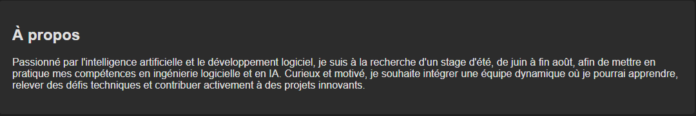

# README - Portfolio Web

## Introduction
Ce projet a pour objectif de présenter un portfolio personnel basé sur HTML et CSS. Il met en avant mes compétences, diplômes, projets et certifications. L'objectif est de fournir une présentation claire et accessible du parcours professionnel et académique.

## Structure du HTML
Le fichier **portfolio.html** définit la structure principale du site web. Le contenu est organisé en plusieurs sections pour offrir une navigation fluide et intuitive :

- **Header** : Affiche le nom et une courte description du profil.
- **Navigation** : Un menu permet d'accéder rapidement aux différentes sections du site.
- **Sections principales** :
  - "À propos" : Présentation personnelle et objectifs professionnels.
  - "Diplômes et Formations" : Liste des diplômes obtenus.
  - "Projets Académiques" : Exemples de projets réalisés et technologies utilisées.
  - "Compétences" : Outils et langages de programmation maîtrisés.
  - "Certifications" : Certifications obtenues avec liens de vérification.
  - "Langues" : Langues parlées.
  - "Contact" : Coordonnées pour prendre contact.

### Captures d'écran de l'ensmble de partie du portfolio :
-  Capture de l'en-tête du site avec le nom et la description.

- Capture du menu de navigation.

- Capture de la section "À propos".

- Capture de la section "Projets Académiques".

- Capture de la section "Contact".

## Feuille de Style (CSS)
Le fichier **styles.css** est conçu pour donner un style moderne et sombre au site. Voici les principales caractéristiques du design :

## Conclusion
Ce portfolio a vocation à évoluer avec le temps pour refléter l'évolution du parcours professionnel et académique.