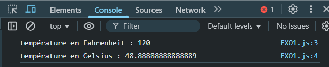
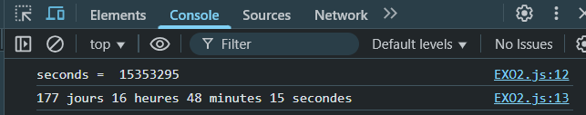
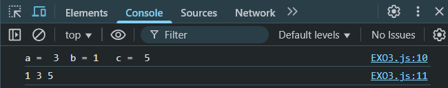
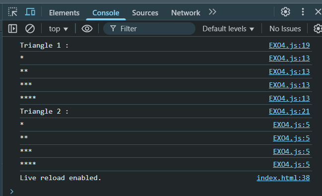
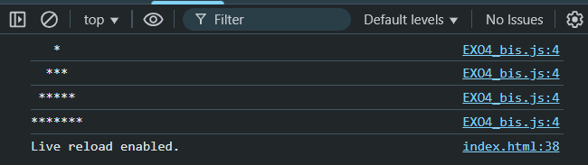
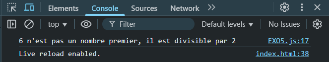
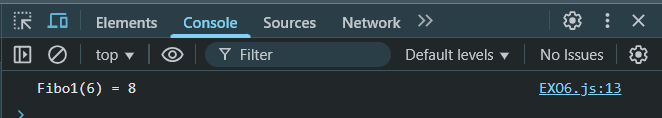
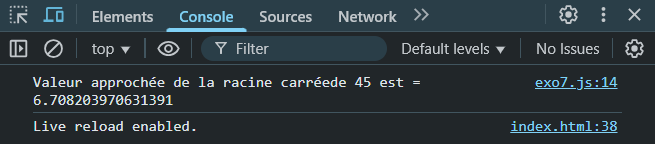

# TP3 - Introduction à la Programmation en JavaScript

## Introduction

Ce projet regroupe plusieurs exercices visant à introduire la programmation en JavaScript à travers des manipulations de variables, des boucles et des conditions. Chaque exercice met en pratique un concept fondamental du langage.

---

## Exercice 1 : Conversion de températures

Convertir une température donnée en Fahrenheit vers Celsius en utilisant la formule :
\(C = \frac{5}{9} (F - 32)\)

```javascript
function degreeC(tempF) {
    let tempC = (5 / 9) * (tempF - 32);
    console.log(`température en Fahrenheit : ${tempF}`);
    console.log(`température en Celsius : ${tempC}`);
}
let tempF = prompt("Entrez la température en Fahrenheit : ");
degreeC(tempF);
```




## Exercice 2 : Conversion de durées


Convertir un nombre donné de secondes en jours, heures, minutes et secondes.


```javascript
function hjms(seconds) {
    var days = Math.floor(seconds / 3600 / 24);
    seconds -= days * 24 * 3600;
    var hours = Math.floor(seconds / 3600);
    seconds -= hours * 3600;
    var minutes = Math.floor(seconds / 60);
    seconds -= minutes * 60;
    return days + " jours " + hours + " heures " + minutes + " minutes " + seconds + " secondes";
}
let seconds = prompt("Entrez le nombre de secondes : ");
console.log(hjms(seconds));
```




## Exercice 3 : Classer 3 nombres

Trier trois nombres donnés en entrée dans l'ordre croissant.

```javascript
function troisNombres(a, b, c) {
    let numbers = [a, b, c];
    numbers.sort();
    return numbers.join(" ");
}
a = prompt("Entrez le premier nombre : ");
b = prompt("Entrez le deuxième nombre : ");
c = prompt("Entrez le troisième nombre : ");
console.log(troisNombres(a, b, c));
```



## Exercice 4 : Affichage de motifs - Triangles

Afficher un motif triangulaire de taille définie.

```javascript
function triangle2(n) {
  let stars = "";
  for (let i = 1; i <= n; i++) {
    stars += "*";
    console.log(stars);
  }
}
function triangle1(n) {
    let stars = "";
    let i = 1;
    while (i <= n) {
        stars += "*";
        console.log(stars);
        i++;
    }
}
let n = prompt("Entrez un nombre : ");
console.log("Triangle 1 :");
triangle1(n);
console.log("Triangle 2 :");
triangle2(n);
```



## Exercice 4-bis : Affichage de motifs - Pyramides

Afficher une pyramide de taille définie.

```javascript
function pyramid(n) {
    for (let i = 1; i <= n; i++) {
        let stars = " ".repeat(n - i) + "*".repeat(2 * i - 1);
        console.log(stars);
    }
}
let n = prompt("Entrez un nombre : ");
pyramid(n);
```



## Exercice 5 : Tester si un nombre est premier

Vérifier si un nombre donné est premier.

```javascript
function Premier(n){
    let i = 2;
    while (i < n){
        if (n % i == 0){
            return [false, i];
        }
        i++;
    }
    return [true,null];
}
let n = prompt("Entrez un nombre : ");
let result = Premier(n);
if (result[0]) {
    console.log(n + " est un nombre premier");
} else {
    console.log(n + " n'est pas un nombre premier, il est divisible par " + result[1]);
}
```



## Exercice 6 : Suite de Fibonacci

Calculer le n-ième terme de la suite de Fibonacci.

```javascript
function Fibo1(n){
    u=[0,1];
    if (n==0 || n==1){
        return n;
    }
    for (let i = 2; i < n; i++){
        u.push(u[i-1]+u[i-2]);
    }
    return u[n-1];
}
let n=prompt("Entrez un nombre : ");
console.log("Fibo1("+n+") = "+Fibo1(n));
```



## Exercice 7 : Valeur approchée de la racine carrée

Calculer une approximation de la racine carrée d'un nombre réel positif.

```javascript
function Raca1(A) {
    if (A <= 0 || A > 100) {
        console.log("Veuillez entrer un nombre entre 1 et 100.");
        return;
    }
    let u = A / 2;
    const epsilon = 1e-5;
    while (Math.abs(u * u - A) >= epsilon) {
        u = 0.5 * (u + A / u);
    }
    console.log(`Valeur approchée de la racine carrée de ${A} est = ${u}`);
}
let A = prompt("Entrez un nombre : ");
Raca1(A);
```


---

## Conclusion

Ce TP permet d'explorer divers concepts fondamentaux de la programmation en JavaScript à travers des exercices pratiques.

