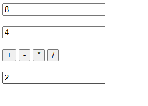

# Introduction

Ce projet contient plusieurs exercices en JavaScript visant à illustrer l'interaction avec le DOM et l'utilisation des événements. Il comprend :

- Exercice 1 : Permutation de valeurs entre deux champs de texte.
- Exercice 2 : Calculatrice simple avec les opérations de base.
- Exercice 3 : Calcul de l'IMC (Indice de Masse Corporelle).
- Exercice 4 : Calculatrice scientifique avec des fonctions avancées.

---

## Exercice 1 : Permutation

### Code
```html
<!DOCTYPE html>
<html lang="fr">
<head>
    <meta charset="UTF-8">
    <title>Permutation</title>
</head>
<body>
    <input type="text" id="in1">
    <input type="text" id="in2">
    <button onclick="permuter()">Permuter</button>
    <script>
        function permuter() {
            let in1 = document.getElementById("in1").value;
            let in2 = document.getElementById("in2").value;
            document.getElementById("in1").value = in2;
            document.getElementById("in2").value = in1;
        }
    </script>
</body>
</html>
```

Ce script permet d'échanger les valeurs entre deux champs de saisie lorsque l'utilisateur clique sur le bouton "Permuter".


---

## Exercice 2 : Calculatrice simple

### Code
```html
<!DOCTYPE html>
<html lang="fr">
<head>
    <meta charset="UTF-8">
    <title>Calculatrice simple</title>
</head>
<body>
    <input type="number" id="in1">
    <input type="number" id="in2">
    <button onclick="addition()">+</button>
    <button onclick="soustraction()">-</button>
    <button onclick="multiplication()">*</button>
    <button onclick="division()">/</button>
    <input type="text" id="result">
    <script>
        function addition(){
            result.value = Number(in1.value) + Number(in2.value);
        }
        function soustraction(){
            result.value = Number(in1.value) - Number(in2.value);
        }
        function multiplication(){
            result.value = Number(in1.value) * Number(in2.value);
        }
        function division(){
            if (Number(in2.value) === 0) alert("Division par zéro impossible");
            else result.value = Number(in1.value) / Number(in2.value);
        }
    </script>
</body>
</html>
```
Cette page permet d'effectuer les quatre opérations de base en utilisant deux nombres fournis par l'utilisateur.



---

## Exercice 3 : Calcul de l'IMC

### Code
```html
<!DOCTYPE html>
<html lang="fr">
<head>
    <meta charset="UTF-8">
    <title>Calcul IMC</title>
</head>
<body>
    <label>Poids (kg):</label>
    <input type="number" id="poids">
    <label>Taille (m):</label>
    <input type="number" id="taille">
    <button onclick="calculer()">Calculer</button>
    <p id="result"></p>
    <script>
        function calculer(){
            let imc = Number(poids.value) / (Number(taille.value) ** 2);
            document.getElementById("result").innerText = "Votre IMC est de " + imc.toFixed(2);
        }
    </script>
</body>
</html>
```
Cette page permet de calculer l'IMC en fonction du poids et de la taille fournis par l'utilisateur.


---

## Exercice 4 : Calculatrice scientifique

### Code
```html
<!DOCTYPE html>
<html lang="fr">
<head>
    <meta charset="UTF-8">
    <title>Calculatrice Scientifique</title>
    <link rel="stylesheet" href="exo4.css">
</head>
<body>
    <div class="calculator">
        <input type="text" id="display" disabled>
        <div class="buttons">
            <button onclick="clearDisplay()">CE</button>
            <button onclick="appendToDisplay('%')">%</button>
            <button onclick="appendToDisplay('sin(')">sin</button>
            <button onclick="calculateResult()">=</button>
        </div>
    </div>
    <script>
        function appendToDisplay(value) {
            let display = document.getElementById('display');
            display.value += value;
        }
        function clearDisplay() {
            document.getElementById('display').value = '';
        }
        function calculateResult() {
            let display = document.getElementById('display').value;
            try {
                display = display.replace('sin', 'Math.sin');
                document.getElementById('display').value = eval(display);
            } catch (e) {
                document.getElementById('display').value = 'Erreur';
            }
        }
    </script>
</body>
</html>
```
Cette calculatrice avancée permet d'effectuer des calculs scientifiques tels que le sinus, le pourcentage et bien d'autres opérations.


---

## Conclusion

Ce projet met en application des concepts de JavaScript liés à la manipulation du DOM et aux événements utilisateurs. Il couvre différents niveaux de complexité, de la simple permutation à une calculatrice avancée.
