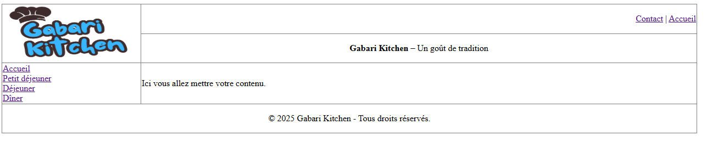
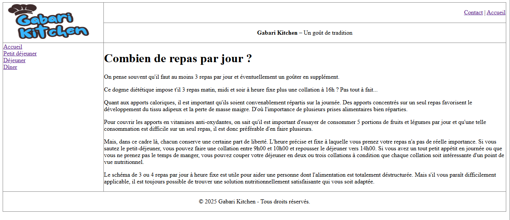
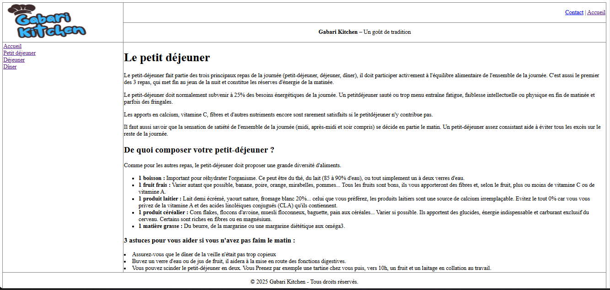
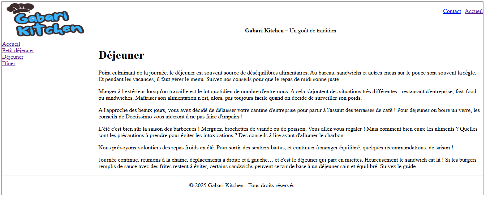
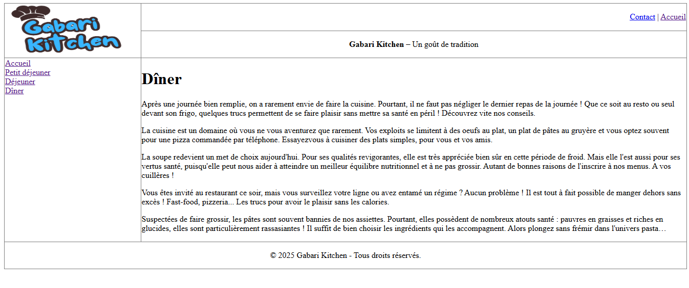

# README - TP Site Web Basé sur des Tableaux

## Introduction
Ce projet consiste en la création d'un site web statique basé sur des tableaux pour structurer le contenu. Il comprend une page d'accueil et trois pages dédiées aux repas de la journée : petit-déjeuner, déjeuner et dîner. Le sitesuit un modèle commun défini dans `gabari.html`.

## Page d'Accueil
La page d'accueil présente des informations générales sur l'importance de la répartition des repas au cours de la journée.

## Page Petit-Déjeuner

Cette page explique l'importance du petit-déjeuner et propose des conseils pour un repas équilibré.

## Page Déjeuner
La page du déjeuner donne des recommandations sur la gestion des repas de midi, notamment pour les repas pris à l'extérieur.

## Page Dîner

Cette page fournit des conseils sur le dîner, en insistant sur l'importance d'un repas léger et équilibré pour bien terminer la journée.

## Structure des Fichiers
- `gabari.html` : Modèle de base utilisé pour toutes les pages
- `index.html` : Page d'accueil
- `petit-dejeuner.html` : Page du petit-déjeuner
- `dejeuner.html` : Page du déjeuner
- `diner.html` : Page du dîner

Chaque fichier suit une structure basée sur des tableaux avec un menu commun, une bannière, un contenu spécifique et un pied de page.

